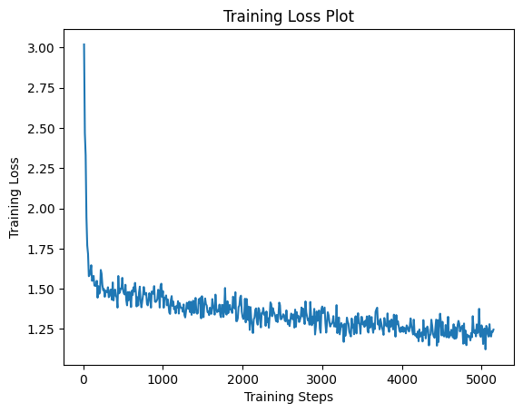

# Chat foodie

    

food recommendation chatbot with LLM fine tuning.

> 2023 graduation project from Pusan Nat'l Univ.

## [Chatbot](https://github.com/jagaldol/chat-foodie/tree/dev/chatbot)

### ChatFoodie(ChatFoodie KoAlpaca Polyglot-ko-5.8B-v1.0) Model

model that trained QLoRA with 8,000 self-instruct datasets.

* Base Model: [beomi/KoAlpaca-Polyglot-5.8B](https://huggingface.co/beomi/KoAlpaca-Polyglot-5.8B)
* Our LoRA: [sm136599/chatfoodie-koalpaca-polyglot-5_8b-5150step-8batch_5epoch](https://huggingface.co/sm136599/chatfoodie-koalpaca-polyglot-5_8b-5150step-8batch_5epoch)

### Example of Deploy Websocket API with Google Colab

you can try Deploy Websocket API in Google Colab.

* [Deploy_chatbot_server_as_public_with_colab.ipynb](https://github.com/jagaldol/chat-foodie/blob/dev/chatbot/Deploy_chatbot_server_as_public_with_colab.ipynb) 

## Server(Spring boot)

Work In Progress

## Front

Work In Progress

## Collaboratory

2023 전기 부산대학교 정보컴퓨터공학부 졸업과제

팀 **쩝쩝학사**

| [[팀장] 안혜준](https://github.com/)                     | [박성민](https://github.com/sm136599)                   | [박진영](https://github.com/icarus012832)                    |
|:-------------------------------------------------------:|:-------------------------------------------------------:|:-----------------------------------------------------------:|
|  |  |  |