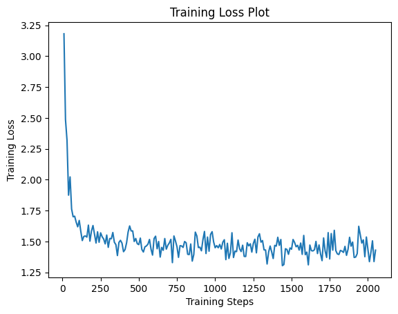

# fine-tune 방식 모델 학습

* QLoRA로 KoAlpaca-Polyglot-ko 5.8B 모델 chatfoodie v1.0 학습 with 4bit
[](https://colab.research.google.com/github/jagaldol/chat-foodie/blob/dev/chatbot/fine-tuning/KoAlpaca_QLoRA_ChatFoodie_Model_FineTuning.ipynb)

* 8200개 (99.8%)샘플로 학습한 모델 생성결과 예시
```
### 질문: 매운 음식 추천해줘

### 답변: 매운 음식으로는 김치찌개, 갈비찜, 떡볶이, 김치찌개, 불고기 등이 추천됩니다. 매운 음식은 한국인들이 좋아하는 대표적인 음식 중 하나로, 자신의 매운 입맛에 맞게 선택하여 즐기면 더욱 맛있습니다. 매운 음식을 선호하시는 분들에게는 매운 음식과 매운 소스를 조합하여 즐겨보세요. 또한, 매운 음식은 건강에 오히려 좋다는 사실을 염두에 두고 맛있게 드세요. 매운 음식을 즐겨보면서 매운 음식에 관심을 가져보는 건 어떨까요?
```

```
### 질문: 저녁 추천해줘

### 답변: 삼겹살과 김치를 함께 구워보세요! 삼겹살과 김치의 맛과 풍미가 조화로운 조합입니다. 저녁으로는 고기를 구워 먹는 것이 가장 좋고, 김치의 상큼한 맛과 삼겹살의 기름 맛이 잘 어울립니다. 삼겹살과 김치를 함께 먹어보세요! 맛있는 식사를 즐겨보세요.
```

## ChatFoodie(ChatFoodie KoAlpaca Polyglot-ko-5.8B-v1.0) 모델 학습

ChatFoodie 모델은 Colab 무료 버전 (T4 16GB 1대)로 학습을 진행하였습니다. 학습에 소요된 시간은 약 79분입니다.

